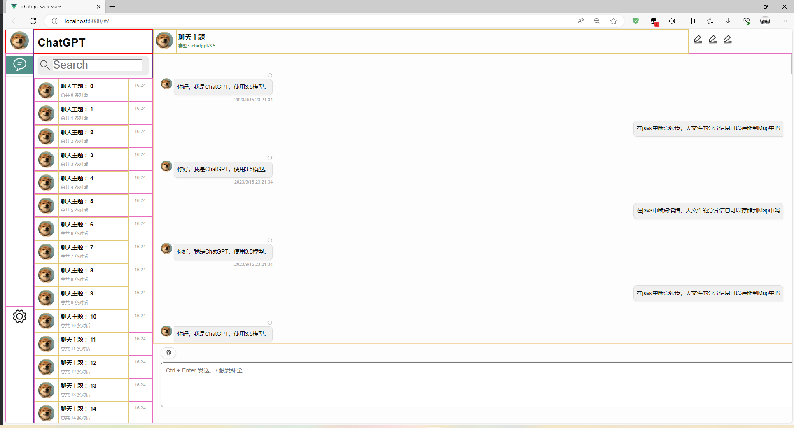

# chatgpt-web-vue3

chatgpt-web-vue3使用vue3的脚手架创建开发，使用使用typescript编写代码。

## 项目介绍
用于ChatGPT套壳项目的开发创建，代码集思广益，不断优化，不断迭代。

此项目是chatgpt-web-vue3是web端的1.0阶段，刚刚搭建好**静态页面**，不具备任何功能。

后端程序员不太会前端，ts第一次使用，代码写的比较粗糙，后期会慢慢优化。

后端服务移步[z-chatgpt-data](https://gitee.com/zhangzhongzhen/z-chatgpt-data)

## 分支结构
- master：主分支，也是稳定分支
-  dev_1.0：1.0阶段开发分支


## 项目运行
```
npm install

npm run serve
```
## 项目截图

